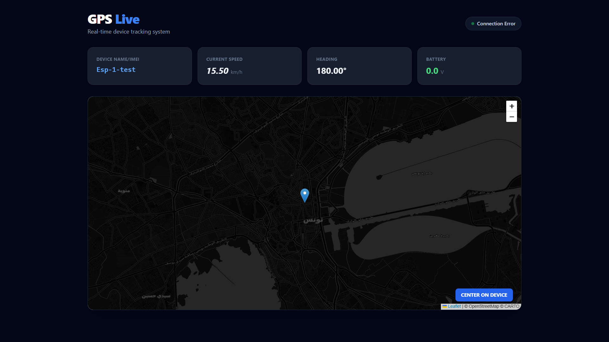
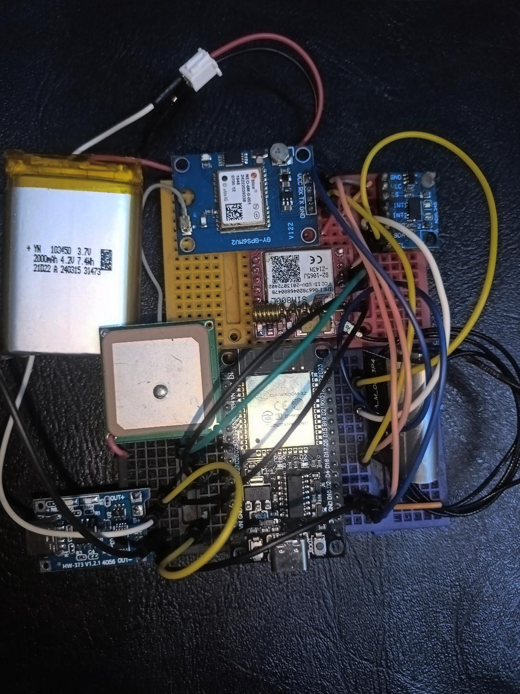
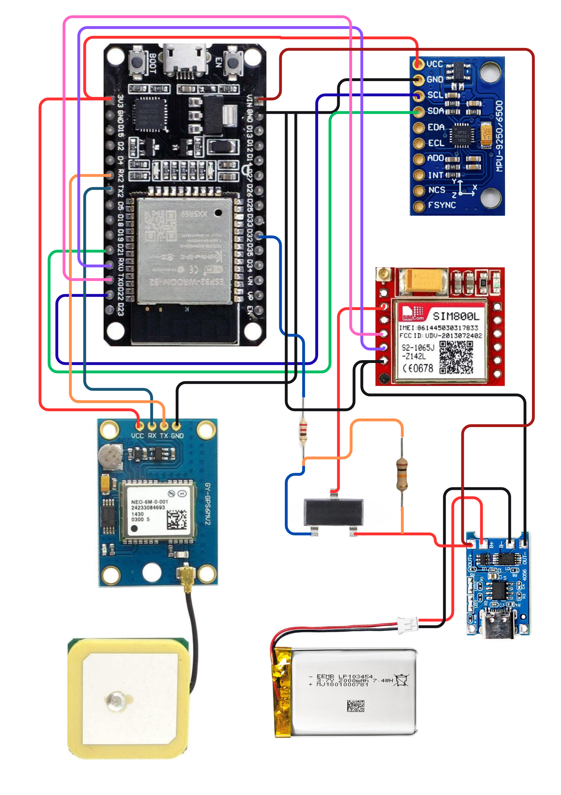

# GPS WebService

<p align="center">
  
  
  
  
  
</p>

---

## 🚀 Live Dashboard Preview

<p align="center">
  
</p>

> A complete GPS Tracking System built from scratch — collecting real-time location data from embedded hardware and streaming it to a live web dashboard.

---

## ✨ Features

| Feature | Description |
|---|---|
| 📡 Real-Time GPS Tracking | Live location updates from ESP32 device |
| 🗺️ Map Dashboard | Interactive live map visualization |
| 🛢️ Cloud Database | MySQL hosted on Aiven |
| 🔄 Auto Registration | Devices register automatically on first contact |
| 🚗 Telemetry | Speed, heading, and battery monitoring |
| 📶 Cellular Connectivity | SIM800L GSM/GPRS module |
| 🔋 Power Optimization | Motion-based power management (12–15h battery life) |

---

## 🏗️ System Architecture

```
┌─────────────────────────────────┐
│   ESP32 + NEO-6M GPS + SIM800L  │
│        (Embedded Hardware)      │
└────────────┬────────────────────┘
             │ HTTP POST (JSON)
             ▼
┌─────────────────────────────────┐
│     Node.js Express API         │
│       (Render Cloud)            │
└────────────┬────────────────────┘
             │
             ▼
┌─────────────────────────────────┐
│     Aiven MySQL Database        │
└────────────┬────────────────────┘
             │
             ▼
┌─────────────────────────────────┐
│    Live Web Dashboard (Map UI)  │
└─────────────────────────────────┘
```

---

## 📂 Project Structure

```
webServGPS-clean/
├── circuit.png                   # Hardware circuit diagram
├── dashboard_screenshot.png      # Dashboard preview
├── prototype_photo.jpg           # Physical prototype photo
├── database/                     # Aiven MySQL database schema
│   ├── aiven-schema.sql          # Complete database setup
│   └── README.md                 # Database setup guide
├── esp32/                        # ESP32 + GPS + SIM800L firmware
│   ├── esp32_gps_sim800l.ino     # Arduino sketch
│   └── README.md                 # Hardware setup guide
├── public/                       # Web dashboard
│   └── index.html                # Live map interface
├── .env.example                  # Environment variables template
├── .gitignore                    # Git ignore rules
├── index.js                      # Node.js Express server
├── package.json                  # Dependencies
└── README.md                     # This file
```

---

## ⚙️ Installation

```bash
npm install
```

---

## ▶️ Running

**Development:**
```bash
npm run dev
```

**Production:**
```bash
npm start
```

---

## 🔌 API Endpoints

| Method | Endpoint | Description |
|---|---|---|
| `POST` | `/api/gps/push` | Receive GPS data from ESP32 |
| `GET` | `/api/gps/latest` | Get latest GPS location |
| `GET` | `/api/devices` | List all registered devices |
| `GET` | `/api/health` | Server health check |
| `DELETE` | `/api/clear` | Clear all stored data |

---

## 🔧 ESP32 Integration

Send a `POST` request to `/api/gps/push` with the following JSON payload:

```json
{
  "device_imei": "ESP32_001",
  "latitude": 36.8065,
  "longitude": 10.1815,
  "speed": 15.5,
  "heading": 180.0,
  "battery_voltage": 3.7
}
```

---

## 🔩 Hardware Setup

### 📦 Prototype

<p align="center">
  
</p>

### 🧩 Circuit Diagram

<p align="center">
  
</p>

### 🔋 ESP32 Power-Efficient GPS Tracker

**Components Used:**

| Component | Purpose |
|---|---|
| ESP32 DevKit | Main microcontroller (WiFi) |
| NEO-6M GPS Module | Location tracking |
| SIM800L GSM/GPRS | Cellular connectivity |
| ADXL345 Accelerometer GY-291 | Motion detection |
| AO3415A P-Channel MOSFET | Power control switch |
| TP4056 Charging Module | Battery management |
| 3.7V LiPo Battery (1000–2000mAh) | Power source |

**⚡ Power Efficiency:**

The system uses **motion-based power management** — the SIM800L cellular module is only powered when movement is detected by the accelerometer.

> This extends battery life from ~2.5 hours to **12–15 hours** under typical usage.

**Quick Start:**
1. Wire all components according to the diagram above (`circuit.png`)
2. Install Arduino libraries: `TinyGPS++`, `TinyGSM`, `ArduinoJson`, `Adafruit_ADXL345`
3. Update your APN and server URL in the `.ino` file
4. Upload to ESP32 and monitor Serial output

See [`esp32/README.md`](esp32/README.md) for complete setup instructions including:
- Full wiring diagram
- MOSFET power control circuit
- Required Arduino libraries
- Configuration and tuning
- Power consumption details
- Troubleshooting guide

---

## 🗄️ Database Setup

Database tables are **automatically created on first run** — no manual setup required.

For manual setup, see [`database/README.md`](database/README.md).

---

## 🚀 Deployment

### Render + Aiven (Recommended)

1. Push code to GitHub
2. Create a **MySQL service** on [Aiven](https://aiven.io) and copy connection details
3. Create a new **Web Service** on [Render](https://render.com)
4. Connect your GitHub repository
5. Configure environment variables in the Render dashboard:

   | Variable | Value |
   |---|---|
   | `DB_HOST` | From Aiven |
   | `DB_USER` | From Aiven |
   | `DB_PASS` | From Aiven |
   | `DB_NAME` | From Aiven |
   | `DB_PORT` | From Aiven |
   | `PORT` | `10000` |

6. Deploy 🎉

> See [DEPLOYMENT.md](DEPLOYMENT.md) for a complete step-by-step guide with screenshots and troubleshooting.

---

## 💡 What This Project Demonstrates

- ⚙️ Embedded systems integration (ESP32 + GPS + GSM)
- 📡 Cellular communication via GSM/GPRS
- 🔄 Real-time backend architecture
- 🌐 REST API design and deployment
- ☁️ Cloud database management (Aiven MySQL)
- 🔋 Hardware-level power optimization
- 🗺️ Full-stack IoT system integration

---

<p align="center">
  Built with ❤️ during internship — from hardware to cloud, end-to-end.
</p>
